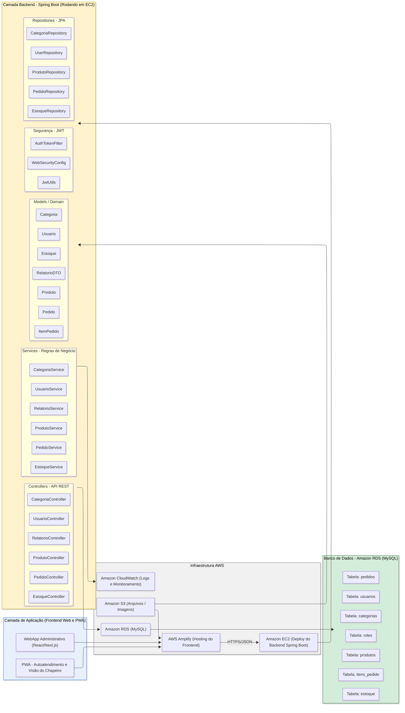

# Arquitetura Geral do - Food Truck

```mermaid
---
config:
  layout: elk
  look: neo
  theme: default-dark
---
flowchart LR

 %% ---------------- FRONTEND ----------------
 subgraph FRONTEND["Camada de Aplicação (Frontend Web e PWA)"]
    WebAdmin["WebApp Administrativo (React/Next.js)"]
    PWAApp["PWA - Autoatendimento e Visão do Chapeiro"]
 end

 %% ---------------- BACKEND LAYERS ----------------
 subgraph CONTROLLER["Controllers - API REST"]
    UsuarioController["UsuarioController"]
    ProdutoController["ProdutoController"]
    CategoriaController["CategoriaController"]
    PedidoController["PedidoController"]
    EstoqueController["EstoqueController"]
    RelatorioController["RelatorioController"]
 end

 subgraph SERVICE["Services - Regras de Negócio"]
    UsuarioService["UsuarioService"]
    ProdutoService["ProdutoService"]
    CategoriaService["CategoriaService"]
    PedidoService["PedidoService"]
    EstoqueService["EstoqueService"]
    RelatorioService["RelatorioService"]
 end

 subgraph REPOSITORY["Repositories - JPA"]
    UserRepository["UserRepository"]
    ProdutoRepository["ProdutoRepository"]
    CategoriaRepository["CategoriaRepository"]
    PedidoRepository["PedidoRepository"]
    EstoqueRepository["EstoqueRepository"]
 end

 subgraph MODEL["Models / Domain"]
    Usuario["Usuario"]
    Produto["Produto"]
    Categoria["Categoria"]
    Pedido["Pedido"]
    ItemPedido["ItemPedido"]
    Estoque["Estoque"]
    RelatorioDTO["RelatorioDTO"]
 end

 subgraph SECURITY["Segurança - JWT"]
    WebSecurityConfig["WebSecurityConfig"]
    JwtUtils["JwtUtils"]
    AuthTokenFilter["AuthTokenFilter"]
 end

 subgraph BACKEND["Camada Backend - Spring Boot (Rodando em EC2)"]
    CONTROLLER
    SERVICE
    REPOSITORY
    MODEL
    SECURITY
 end

 %% ---------------- DATABASE ----------------
 subgraph DATABASE["Banco de Dados - Amazon RDS (MySQL)"]
    TB_USUARIOS["Tabela: usuarios"]
    TB_PRODUTOS["Tabela: produtos"]
    TB_PEDIDOS["Tabela: pedidos"]
    TB_ITENS["Tabela: itens_pedido"]
    TB_ESTOQUE["Tabela: estoque"]
    TB_CATEGORIAS["Tabela: categorias"]
    TB_ROLES["Tabela: roles"]
 end

 %% ---------------- INFRA ----------------
 subgraph INFRA["Infraestrutura AWS"]
    Amplify["AWS Amplify (Hosting do Frontend)"]
    EC2Backend["Amazon EC2 (Deploy do Backend Spring Boot)"]
    S3Bucket["Amazon S3 (Arquivos / Imagens)"]
    RDSInstance["Amazon RDS (MySQL)"]
    CloudWatch["Amazon CloudWatch (Logs e Monitoramento)"]
 end

 %% ---------------- CONNECTIONS ----------------
 WebAdmin --> Amplify
 PWAApp --> Amplify

 Amplify -- HTTPS/JSON --> EC2Backend
 EC2Backend --> BACKEND

 BACKEND --> RDSInstance
 BACKEND --> CloudWatch

 RDSInstance --> DATABASE

 S3Bucket --> Amplify
 S3Bucket --> BACKEND

 %% ---------------- STYLES ----------------
 classDef frontend fill:#e8f0fe,stroke:#1a73e8,stroke-width:1px,color:#000;
 classDef backend fill:#fff3cd,stroke:#b59b00,stroke-width:1px,color:#000;
 classDef db fill:#d4edda,stroke:#155724,stroke-width:1px,color:#000;
 classDef infra fill:#f1f1f1,stroke:#5f6368,stroke-width:1px,color:#000;

 class FRONTEND frontend;
 class BACKEND backend;
 class DATABASE db;
 class INFRA infra;
```

