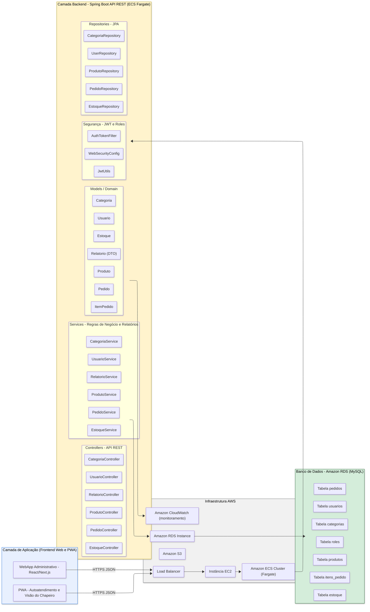

# Diagrama Backend - Food Truck

```mermaid
---
config:
  layout: elk
  look: neo
  theme: default-dark
---
flowchart LR
 subgraph FRONTEND["Camada de Aplicação (Frontend Web e PWA)"]
        WebAdmin["WebApp Administrativo - React/Next.js"]
        PWAApp["PWA - Autoatendimento e Visão do Chapeiro"]
  end
 subgraph CONTROLLER["Controllers - API REST"]
        UsuarioController["UsuarioController"]
        ProdutoController["ProdutoController"]
        CategoriaController["CategoriaController"]
        PedidoController["PedidoController"]
        EstoqueController["EstoqueController"]
        RelatorioController["RelatorioController"]
  end
 subgraph SERVICE["Services - Regras de Negócio e Relatórios"]
        UsuarioService["UsuarioService"]
        ProdutoService["ProdutoService"]
        CategoriaService["CategoriaService"]
        PedidoService["PedidoService"]
        EstoqueService["EstoqueService"]
        RelatorioService["RelatorioService"]
  end
 subgraph REPOSITORY["Repositories - JPA"]
        UserRepository["UserRepository"]
        ProdutoRepository["ProdutoRepository"]
        CategoriaRepository["CategoriaRepository"]
        PedidoRepository["PedidoRepository"]
        EstoqueRepository["EstoqueRepository"]
  end
 subgraph MODEL["Models / Domain"]
        Usuario["Usuario"]
        Produto["Produto"]
        Categoria["Categoria"]
        Pedido["Pedido"]
        ItemPedido["ItemPedido"]
        Estoque["Estoque"]
        Relatorio["Relatorio (DTO)"]
  end
 subgraph SECURITY["Segurança - JWT e Roles"]
        WebSecurityConfig["WebSecurityConfig"]
        JwtUtils["JwtUtils"]
        AuthTokenFilter["AuthTokenFilter"]
  end
 subgraph BACKEND["Camada Backend - Spring Boot API REST (ECS Fargate)"]
        CONTROLLER
        SERVICE
        REPOSITORY
        MODEL
        SECURITY
  end
 subgraph DATABASE["Banco de Dados - Amazon RDS (MySQL)"]
        TB_USUARIOS["Tabela usuarios"]
        TB_PRODUTOS["Tabela produtos"]
        TB_PEDIDOS["Tabela pedidos"]
        TB_ITENS["Tabela itens_pedido"]
        TB_ESTOQUE["Tabela estoque"]
        TB_CATEGORIAS["Tabela categorias"]
        TB_ROLES["Tabela roles"]
  end
 subgraph INFRA["Infraestrutura AWS"]
        ECSCluster["Amazon ECS Cluster (Fargate)"]
        EC2Proxy["Instância EC2"]
        LoadBalancer["Load Balancer"]
        RDSInstance["Amazon RDS Instance"]
        S3Bucket["Amazon S3"]
        CloudWatch["Amazon CloudWatch (monitoramento)"]
  end
    WebAdmin -- HTTPS JSON --> LoadBalancer
    PWAApp -- HTTPS JSON --> LoadBalancer
    LoadBalancer --> EC2Proxy
    EC2Proxy --> ECSCluster
    ECSCluster --> BACKEND
    BACKEND --> RDSInstance & CloudWatch
    RDSInstance --> DATABASE
    
     BACKEND:::backend
     DATABASE:::db
     FRONTEND:::frontend
     INFRA:::infra

    classDef frontend fill:#e8f0fe,stroke:#1a73e8,stroke-width:1px,color:#000
    classDef backend fill:#fff3cd,stroke:#b59b00,stroke-width:1px,color:#000
    classDef db fill:#d4edda,stroke:#155724,stroke-width:1px,color:#000
    classDef infra fill:#f1f1f1,stroke:#5f6368,stroke-width:1px,color:#000
```

