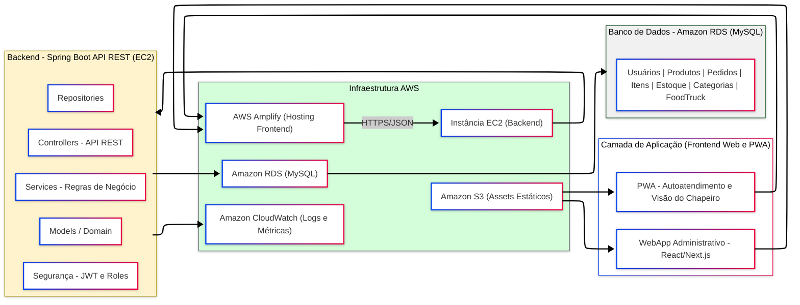

```mermaid
---
config:
  layout: elk
  look: neo
  theme: neo
---
flowchart LR
 subgraph FRONTEND["Camada de Aplicação (Frontend Web e PWA)"]
        WebAdmin["WebApp Administrativo - React/Next.js"]
        PWAApp["PWA - Autoatendimento e Visão do Chapeiro"]
  end
  
 subgraph BACKEND["Backend - Spring Boot API REST (EC2)"]
        Controllers["Controllers - API REST"]
        Services["Services - Regras de Negócio"]
        Repositories["Repositories"]
        Models["Models / Domain"]
        Security["Segurança - JWT e Roles"]
  end

 subgraph DATABASE["Banco de Dados - Amazon RDS (MySQL)"]
        Tabelas["Usuários | Produtos | Pedidos | Itens | Estoque | Categorias | FoodTruck"]
  end

 subgraph INFRA["Infraestrutura AWS"]
        Amplify["AWS Amplify (Hosting Frontend)"]
        EC2Backend["Instância EC2 (Backend)"]
        S3["Amazon S3 (Assets Estáticos)"]
        RDS["Amazon RDS (MySQL)"]
        CloudWatch["Amazon CloudWatch (Logs e Métricas)"]
  end

    %% Fluxos principais
    WebAdmin --> Amplify
    PWAApp --> Amplify

    Amplify -- HTTPS/JSON --> EC2Backend
    EC2Backend --> BACKEND

    BACKEND --> RDS
    BACKEND --> CloudWatch
    RDS --> DATABASE

    S3 --> WebAdmin
    S3 --> PWAApp

     BACKEND:::backend
     DATABASE:::db
     INFRA:::infra

    classDef frontend fill:#e8f0fe,stroke:#1a73e8,stroke-width:1px,color:#000
    classDef backend fill:#fff3cd,stroke:#b59b00,stroke-width:1px,color:#000
    classDef db fill:#f1f1f1,stroke:#155724,stroke-width:1px,color:#000
    classDef infra fill:#d4fdda,stroke:#5f6368,stroke-width:1px,color:#000
```