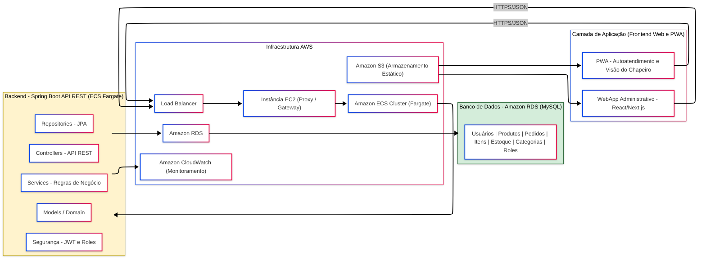

```mermaid

---
config:
  layout: elk
  look: neo
  theme: neo
---
flowchart LR
 subgraph FRONTEND["Camada de Aplicação (Frontend Web e PWA)"]
        WebAdmin["WebApp Administrativo - React/Next.js"]
        PWAApp["PWA - Autoatendimento e Visão do Chapeiro"]
  end
  
 subgraph BACKEND["Backend - Spring Boot API REST (ECS Fargate)"]
        Controllers["Controllers - API REST"]
        Services["Services - Regras de Negócio"]
        Repositories["Repositories - JPA"]
        Models["Models / Domain"]
        Security["Segurança - JWT e Roles"]
  end

 subgraph DATABASE["Banco de Dados - Amazon RDS (MySQL)"]
        Tabelas["Usuários | Produtos | Pedidos | Itens | Estoque | Categorias | Roles"]
  end

 subgraph INFRA["Infraestrutura AWS"]
        S3["Amazon S3 (Armazenamento Estático)"]
        LoadBalancer["Load Balancer"]
        EC2["Instância EC2 (Proxy / Gateway)"]
        ECS["Amazon ECS Cluster (Fargate)"]
        RDS["Amazon RDS"]
        CloudWatch["Amazon CloudWatch (Monitoramento)"]
  end

    WebAdmin -- HTTPS/JSON --> LoadBalancer
    PWAApp -- HTTPS/JSON --> LoadBalancer
    LoadBalancer --> EC2
    EC2 --> ECS
    ECS --> BACKEND
    BACKEND --> RDS & CloudWatch
    RDS --> DATABASE
    S3 --> WebAdmin & PWAApp
     BACKEND:::backend
     DATABASE:::db

    classDef frontend fill:#e8f0fe,stroke:#1a73e8,stroke-width:1px,color:#000
    classDef backend fill:#fff3cd,stroke:#b59b00,stroke-width:1px,color:#000
    classDef db fill:#d4edda,stroke:#155724,stroke-width:1px,color:#000
    classDef infra fill:#f1f1f1,stroke:#5f6368,stroke-width:1px,color:#000
```