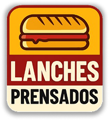
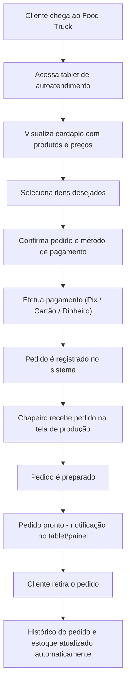
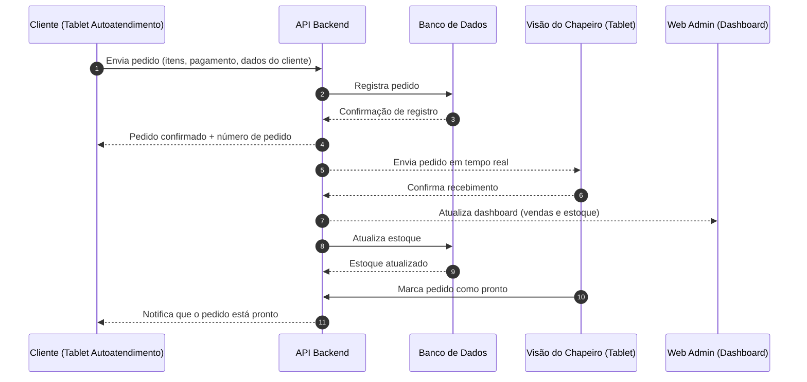
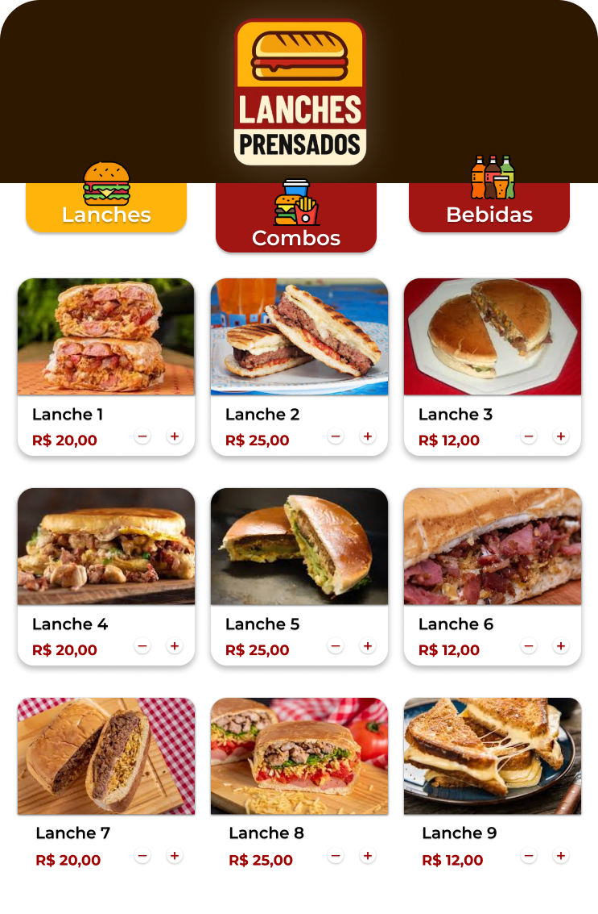

# Documento de Visão — Sistema de Gerenciamento e Autoatendimento para Food Trucks

  

## 1. Introdução

### 1.1 Objetivo do Projeto  
O objetivo do projeto é desenvolver um sistema digital integrado de gerenciamento e autoatendimento para food trucks, que permita automatizar o registro de vendas, controlar o estoque de insumos, organizar pedidos e pagamentos, além de oferecer relatórios de desempenho em tempo real.

A solução visa aumentar a eficiência operacional, reduzir erros no atendimento, melhorar a experiência do cliente e fornecer ao proprietário maior controle financeiro e organizacional do negócio.

### 1.2 Escopo do Produto  
O sistema será composto por:  
- **Aplicativo Web (Gestão e Administração)**: cadastro e gerenciamento de food trucks, controle de estoque, registro e acompanhamento de vendas, dashboard analítico e histórico de clientes.  
- **Aplicativo Mobile (Atendimento e Produção)**: autoatendimento via tablets no food truck, visão do chapeiro para acompanhamento de pedidos, integração com WhatsApp para pedidos e notificações.  
- **Infraestrutura**: hospedagem em nuvem, garantindo escalabilidade, segurança e acesso remoto.

### 1.3 Definições, Acrônimos e Abreviações  
| Termo/Acrônimo  | Definição |
|-----------------|-----------|
| Food truck      | Veículo adaptado para produção e venda de alimentos em diferentes locais. |
| Dashboard       | Painel com indicadores de desempenho. |
| Autoatendimento | Pedido realizado pelo cliente sem intervenção direta do atendente. |
| Pix             | Sistema de pagamentos instantâneos. |
| Visão do Chapeiro| Interface para controle dos pedidos em preparo. |
| Mapa de calor   | Representação visual de concentração de vendas. |
| Cloud           | Hospedagem em servidores remotos. |

### 1.4 Referências  
1. Redes de fast food (McDonald's, Burger King).  
2. Experiência prática do Food Truck do Sr. Elpídio.  
3. Sistemas de gestão de estabelecimentos alimentícios.  
4. Projetos anteriores do curso de Análise e Desenvolvimento de Sistemas (SENAI).

## 2. Posicionamento

### 2.1 Oportunidade de Negócio  
O crescimento nas vendas do Food Truck do Sr. Elpídio expôs limitações do processo manual atual, que gera lentidão no atendimento, erros e falta de controle de estoque e pagamentos. A modernização digital representa oportunidade para aumentar eficiência, organização e satisfação do cliente.

### 2.2 Problema a Ser Resolvido  
- Anotações incorretas ou confusas;  
- Falta de controle claro sobre pagamentos;  
- Atendimento lento em horários de pico;  
- Ausência de histórico automático de pedidos/clientes;  
- Dificuldade no controle de estoque.

### 2.3 Descrição do Produto  
Sistema dividido em:  
- **Web (Administração)**: cadastro de food trucks, registro e controle de pedidos, estoque, dashboard de vendas, análise de locais mais rentáveis.  
- **Mobile (Autoatendimento e Operações)**: pedidos pelo cliente via tablet/WhatsApp, visão do chapeiro, login para funcionários.  

### 2.4 Declaração de Posição do Produto  
Para donos de pequenos negócios de alimentação que precisam de mais controle e agilidade, o Sistema de Gestão para Food Trucks é uma solução digital e acessível que auxilia na automatização vendas, organização de estoque e melhoria da experiência do cliente sem exigir conhecimento técnico avançado.

## 3. Stakeholders e Usuários

### 3.1 Identificação dos Stakeholders  
* Principal stakeholder: **Sr. Elpídio Castro Alvez dos Santos Sobrinho** (proprietário).  
* Necessidades: reduzir custos, otimizar trabalho, melhorar controle financeiro e organizar pedidos/pagamentos.

### 3.2 Perfis dos Usuários  
Consumidores que buscam refeições rápidas e práticas, familiarizados com WhatsApp e aplicativos móveis.

### 3.3 Necessidades dos Usuários e Stakeholders  
- Cadastro/registro automatizado de pedidos;  
- Integração com métodos de pagamento;  
- Histórico acessível de pedidos;  
- Dashboard de controle financeiro;  
- Fácil uso;  
- Gestão de estoque.

### 3.4 Ambiente Operacional
Inicialmente, o sistema será executado em ambiente local utilizando Docker, com as aplicações separadas em repositórios distintos e orquestradas por meio de um Docker Compose centralizado.

A hospedagem em AWS será considerada em etapas posteriores, caso seja viável, visando oferecer escalabilidade, alta disponibilidade, segurança e acesso por dispositivos móveis e navegadores.

## 4. Descrição do Produto

### 4.1 Perspectiva do Produto  
Novo sistema para substituir processo manual, composto por Web (administração) e Mobile (autoatendimento/chapeiro), com a possibilidade futura de integração ao WhatsApp e gateways de pagamento.

### 4.2 Principais Funcionalidades  
- Cadastro e gerenciamento de cardápio/produtos;  
- Registro de pedidos presenciais e autoatendimento;  
- Controle de estoque e alertas de reposição;  
- Registro e acompanhamento de pagamentos;  
- Dashboard de KPI’s;  
- Mapa/heatmap de vendas;  
- Tela de preparo com pedidos em tempo real.

### 4.3 Suposições e Dependências  
- Dispositivos conectados à internet disponíveis;  
- Usuários com habilidade básica;  
- Conexão online na maior parte do tempo;  
- Custos de integrações externas sob aprovação.

### 4.4 Limitações  
- Não captura direta de dados de cartão;  
- Heatmap depende de dados de localização;  
- Solução de baixo custo, priorizando open-source.

## 5. Requisitos de Alto Nível

### 5.1 Funcionais  
- Cadastro e gerenciamento de food trucks e estoque;  
- Registro de pedidos;  
- Processamento de pagamentos;  
- Dashboard analítico;  
- Autoatendimento via dispositivos móveis;  
- Histórico de clientes/pedidos.

### 5.2 Não Funcionais  
- Interface simples e intuitiva;  
- Alta disponibilidade;  
- Aplicação responsiva;  
- Tempo de resposta rápido;  
- Segurança de dados;  
- Custo compatível.

## 6. Características de Qualidade do Produto

- **Usabilidade:** fluxo de pedido em até 60s.  
- **Confiabilidade:** sucesso de registro ≥ 99%.  
- **Desempenho:** API < 500ms; pedidos visíveis em até 2s.  
- **Segurança:** HTTPS, controle de acesso, LGPD.  
- **Portabilidade:** compatível com mobile/desktop.  
- **Manutenibilidade:** código modular.  
- **Observabilidade:** logs e métricas.

## 7. Restrições  
- Dependência de conexão estável para operação plena.  
- Integrações externas dependem de contratação.  
- Limite de orçamento.

## 8. Riscos  
- Conexão de internet instável em alguns locais;  
- Dependência do sistema: falhas podem interromper o atendimento.

## 9. Cronograma de Marcos  
- **11/08:** Proposta inicial;  
- **22/08:** Documento de visão com objetivos, público-alvo, modelo de negócio, protótipo e planejamento de sprints;  
- **03/10:** Entrega parcial;  
- **12/12:** Entrega final.

## 10. Apêndices  

 

### ➡️ ***Fluxo de atendimento ao cliente***

 

 
 

### ➡️ ***Fluxo de Interação das Aplicações***

 

 
 

### ➡️ ***Protótipo Mobile (Figma)***
* [Link Figma](https://www.figma.com/design/UX4wHB3jTXKFQXaw4RPY4P/Projeto-Integrador---Food-Truck?node-id=0-1&t=BHeLJxnsuqpjYUT6-1)

<!-- Tela de Login -->

  <h2 style="text-align: center;">Tela de Login</h2>
  

<!-- Tela de Cadastro -->

  <h2 style="text-align: center;">Tela de Cadastro</h2>
  

<!-- Tela Inicial -->

  <h2 style="text-align: center;">Tela Inicial</h2>
  

<!-- Tela de Produto -->

  <h2 style="text-align: center;">Tela de Produto</h2>
  

<!-- Tela de Carrinho -->

  <h2 style="text-align: center;">Tela de Carrinho</h2>
  

<!-- Tela de Pagamento -->

  <h2 style="text-align: center;">Tela de Pagamento</h2>
  

<!-- Pop up de Pagamento -->

  <h2 style="text-align: center;">Pop up de Pagamento</h2>
  

<!-- Tela de Agradecimento -->

  <h2 style="text-align: center;">Tela de Agradecimento</h2>
  

<!-- Tela do Chapeiro -->

  <h2 style="text-align: center;">Tela do Chapeiro</h2>
  

 
 
 

### ➡️ ***Planejamento das Sprints - 03/10***
* [Planejamento das Sprints - Entrega 03/10](Planejamento_Sprints_Entrega_03-10.md)