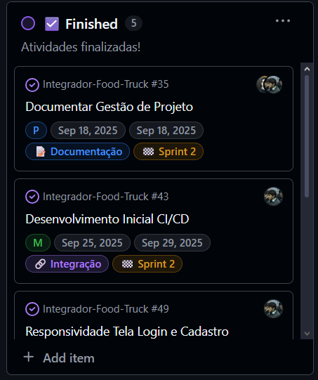
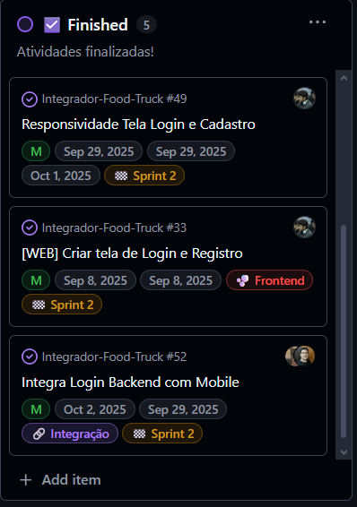

# Relatório Quinzenal

## Objetivo da Sprint

O objetivo principal é o desenvolvimento das funcionalidades:

WEB
- Tela login
- Tela cadastro
- Rotas das outras telas
- Responsividade das telas

MOBILE
- Estilização de todas as telas
- Integração com o backend na funcionalidade de login/cadastro
- Responsividade das telas

AWS
- Criação RDS
- Criação EC2
- Criação ECS

BANCO DE DADOS
- Criação do modelo de entidade e relacionamento (MER)
- Criação do script SQL e relaciomento entre as tabelas

BACKEND
- Criação dos rotas GET,POST nas telas de login e cadastro (moblie)
- Autenticação com JWT

## Lista de atividades Concluídas

## Próximos passos para a próxima sprint

WEB
- Implemenação dos gráficos em cada tela
- Integração com o Backend

MOBILE
- Responsividade das telas
- Integração das outras funcionalidades (Home page)
- Autenticação nas páginas

AWS
- Finalização de configuração do ECS e Fargate

BANCO DE DADOS
- Preenchimento das tabelas com dados

BACKEND
- Integração das funcionalidades web/mobile
- Implementação do Oauth

## Resumo de rastreabilidade → Issues x PRs x entregas

## O que funcionou bem
A gestão do projeto do GitHub está bem padronizada e eficiênte

## O que não funcionou
Não desenvolvemos a quantidade de tarefas o suficiente da sprint

## O que pode ser melhorado na próxima sprint
Maior presença da equipe para a realização do projeto