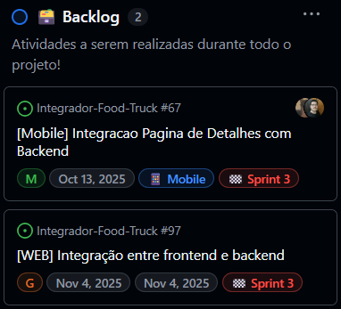
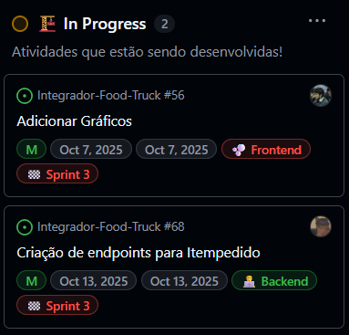
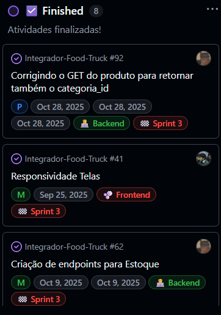
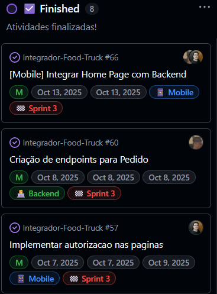
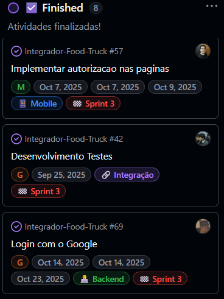
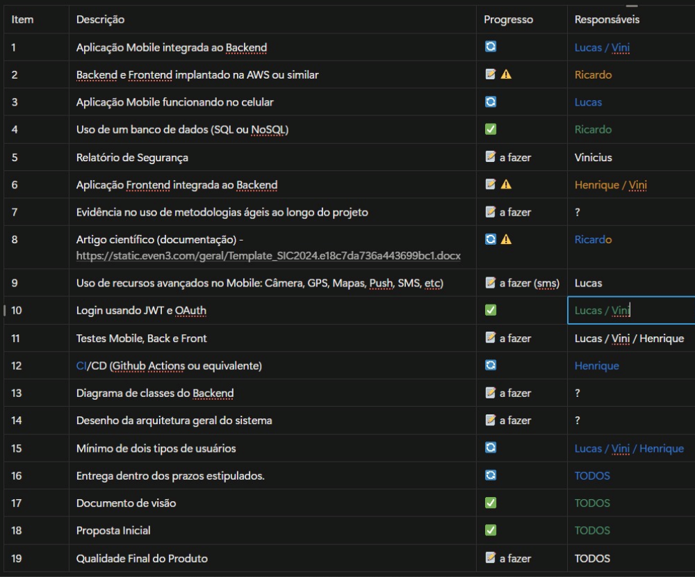

# Relatório Quinzenal

## Objetivo da Sprint

Data Inicial: 17/10
Data Final: 06/11

O objetivo principal está no desenvolvimento das funcionalidades:

WEB
- Tela login (Autenticação JWT e Oauth)
- Tela cadastro (Autenticação JWT e Oauth)
- Ver quais dados colocar na tela de estoque

MOBILE
- Integração telas Home, Carrinho, Detalhe, Produto e Pagamento
- Tela Chapeiro e adicionar/remover produtos

AWS
- Adicionar tabela Truck
- Adicionar login e senha

BANCO DE DADOS
- Diagrama de classes
- Diagrama od banco de dados

BACKEND
- Adicionar endpoint GET e POST para Truck

## Lista de atividades Concluídas

## Resumo de rastreabilidade → Issues x PRs x entregas

## O que funcionou bem
A gestão do projeto do GitHub está bem padronizada e eficiênte

## O que não funcionou
Não desenvolvemos a quantidade de tarefas o suficiente da sprint

## O que pode ser melhorado na próxima sprint
Maior presença da equipe para a realização do projeto